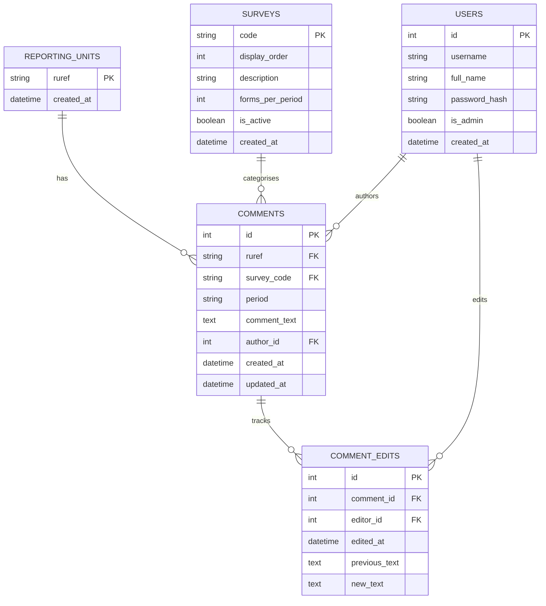
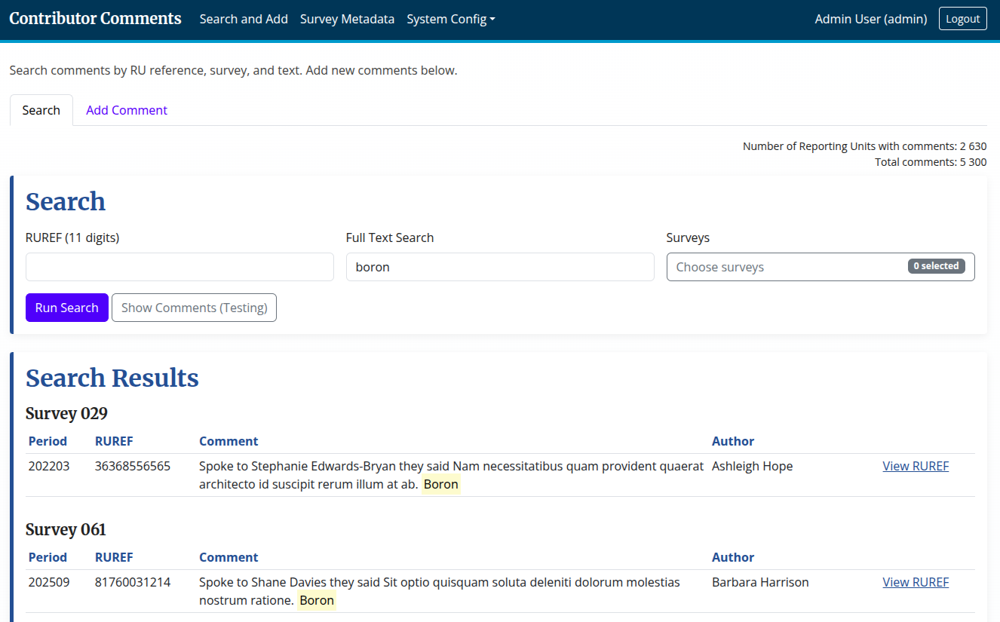
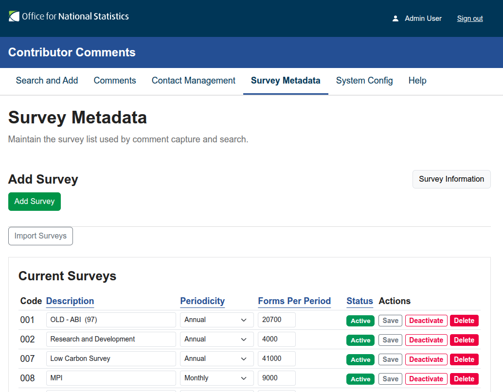
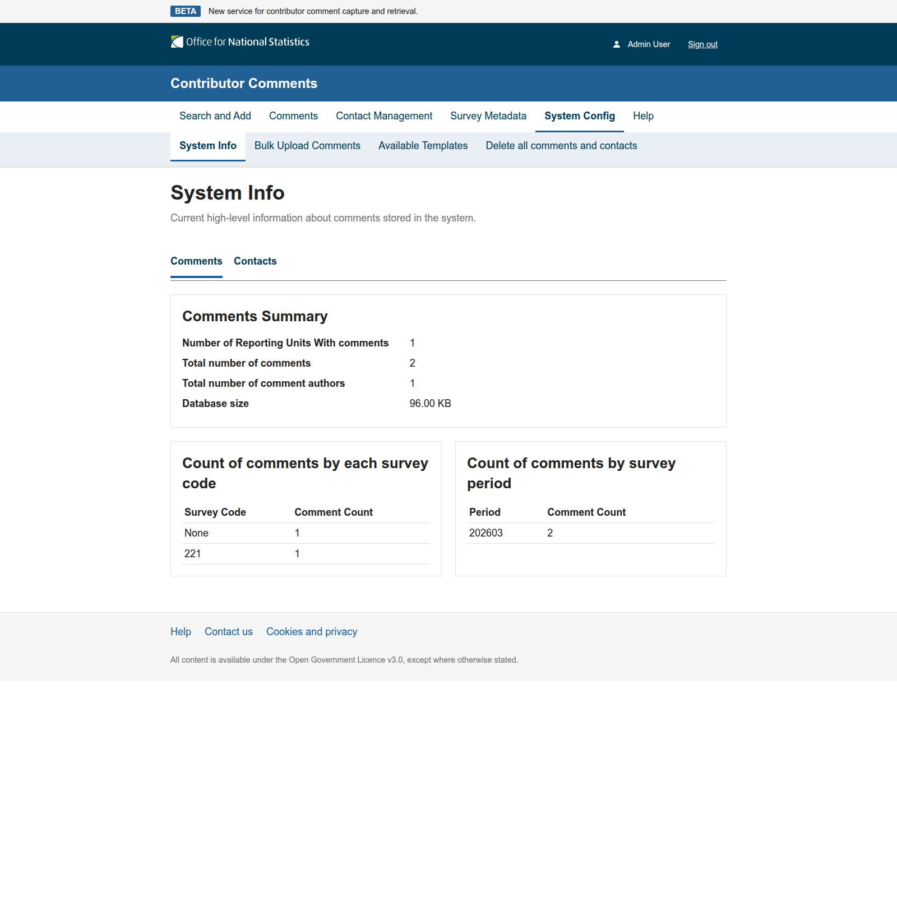

# Contributor Comments

Contributor Comments is a Flask + Jinja application for capturing and searching unstructured contributor comments for ONS users.

## Implemented Scope

- Flask web application with Jinja templates
- PostgreSQL-backed data model
- Survey metadata management
- Authentication with seeded test users
- Comment capture, edit history, and search
- ONS-style frontend pattern aligned with existing Flexi approach
- Terraform scaffold for AWS resources
- Concourse pipeline scaffold for test/build/deploy

## Data Model

- `reporting_units`
	- `ruref` (11 numeric chars, PK)
- `surveys`
	- `code` (3 chars, PK)
	- `display_order`
	- `description` (text description of survey)
	- `forms_per_period` (numeric count)
- `comments`
	- `id` (PK)
	- `ruref` (FK to reporting_units)
	- `survey_code` (FK to surveys, nullable for general comments)
	- `is_general` (bool flag for comments not tied to one survey)
	- `period` (YYYYMM)
	- `comment_text`
	- `author_id` (FK to users)
	- `created_at` (UTC)
- `contacts`
	- `id` (PK)
	- `ruref` (FK to reporting_units)
	- `survey_code` (FK to surveys, nullable for general contact)
	- `name`
	- `telephone_number`
	- `email_address`
- `comment_edits`
	- Tracks editor, edit timestamp, previous text, and new text
- `users`
	- App login users (author/editor identity source)

## ER Diagram



## Functional Behaviour

- Authentication defaults to SSO (`AUTH_MODE=sso`) with role checks retained in the `users` table
- SSO users are provisioned on first login (non-admin by default) and then controlled via local granular access
- RUREF validation: exactly 11 numeric characters
- Period validation: strict `YYYYMM` with valid month
- Search supports:
	- Direct RUREF lookup
	- Survey filter (single or multiple)
	- Full-text contains search across comment text, key identifiers, and comment author name/username
- Main page uses separate tabs for `Search` and `Add Comment`
- Search text matches are highlighted in the comment text shown in results
- Search tab includes `Show Comments (Testing)` to load the lowest 10 RUREFs with comments, grouped in the usual survey order
- Search results are shown only after a search is performed
- RUREF detail page groups comments by survey in configured survey order, with descending period order
- General comments are supported and appear before survey-specific comments in grouped results
- Search filtered to one or more surveys still includes general comments
- Author is displayed as `Author: <name>` after each comment, with created timestamp on hover tooltip
- Comment edits are recorded in a true edit history table
- Optional contacts are supported at reporting-unit + survey scope, plus reporting-unit + general scope
- Search and Show Comments include a `Show Contact Information` radio toggle (`No`/`Yes`)
- Contact details render in compact read-only mode when `Show Contact Information` is `Yes` and a contact name is present
- When a contact is shown, the UI displays Name, Telephone, and Email; missing telephone/email values are shown as `Not provided`
- Top-level `Contact Management` page supports:
	- RUREF-filtered contact search
	- Show all contacts
	- Full contact details shown within each RUREF and ordered by survey (General first)
	- Edit links for each contact
- If a contact already exists for the same reporting unit and scope, users are redirected to edit the existing contact instead of creating another
- Contact editing is available to all authenticated users
- Admin survey metadata supports create, update, activate/deactivate, and complete delete (with confirmation)

### Recent Behavior Changes

- Contact and author display labels are explicit in comment results:
	- `Author: <name>`
	- `Contact: Name, Telephone, Email`
- Contact blocks are controlled by `Show Contact Information`:
	- `No`: no contact block is shown
	- `Yes`: contact block is shown when contact name is present; telephone/email show `Not provided` when missing
- Contact visibility behavior is consistent across:
	- Search Results
	- Show Comments (Testing)
	- RUREF detail page

### Import Surveys (Admin)

- The Survey Metadata page includes an `Import Surveys` button.
- Import source file: `surveys.csv` at the repository root.
- Expected CSV headers:
	- `Survey`
	- `Description`
	- `Periodicity`
	- `Forms_per_period`
- Import behavior:
	- Upserts by survey code (`Survey`): creates missing rows, updates existing rows.
	- Invalid or blank `Periodicity` is normalized to `Other`.
	- Blank/invalid/negative `Forms_per_period` is normalized to `0`.
	- Invalid survey codes (not exactly 3 digits) are skipped.

### System Config: Bulk Upload Comments (Admin)

- Top navigation now includes `System Config` for admin users.
- First menu item: `Bulk Upload Comments`.
- Upload uses a file picker and accepts CSV files.

CSV columns:

- Required:
	- `ruref`
	- `period`
	- `comment_text`
- Optional:
	- `survey_code`
	- `is_general`
	- `author_name`
	- `saved_at` (accepted formats: `YYYY-MM-DD HH:MM:SS`, `YYYY-MM-DDTHH:MM:SS`, `YYYY-MM-DD`)

Import rules:

- `ruref` must be exactly 11 numeric characters.
- `period` must be valid `YYYYMM`.
- Survey-specific rows require `survey_code` to exist and be active in Survey Metadata.
- Survey-specific rows must match survey periodicity rules:
	- Monthly: any month
	- Quarterly: `03`, `06`, `09`, `12`
	- Annual: `12`
	- Other: `12`
	- Exception: survey `141` requires month `04`
- General comment rows can be supplied either by leaving `survey_code` blank or by setting `is_general` to a truthy value (`1`, `true`, `yes`, `y`).
- General comment rows are imported with no survey code and are not checked against survey periodicity metadata.
- Missing reporting units are created automatically.
- If `author_name` is provided, the importer reuses or creates a user record for that name.
- Rows failing validation are skipped.
- On completion, the UI shows added comment count, skipped row count, and elapsed seconds.

### System Config: System Info (Admin)

- System Config includes a `System Info` page for admin users.
- The page displays two tabs:
	- `Comments` tab:
		- Number of Reporting Units with comments
		- Total number of comments
		- Total number of comment authors
		- Database size
		- Count of comments by each survey code
		- Count of comments by survey period
	- `Contacts` tab:
		- Number of Reporting Units with contacts
		- Total number of contacts
		- Count of contacts by survey scope (`General` and survey code)

## Screenshots

### Search Results for `boron`



### Survey Metadata



### System Information



## Seed Data

Local and dev startup runs:

- `db.create_all()`
- Survey seed list: `221`, `241`, `002`, `023`, `138`
- Test users:
	- `admin` / `Password123!`
	- `analyst1` / `Password123!`
	- `analyst2` / `Password123!`

## Getting started for Devs
## Local Run

### Conda + uv (recommended if you must use conda)

Run these commands from the repo root:

```bash
conda activate work
uv pip install -r requirements.txt
cp .env.example .env
set -a && source .env && set +a
uv run -- python -m alembic upgrade head
uv run -- python run.py
```

### Conda (setup)

If you don't have the `work` conda env yet:

```bash
conda install -n work -y python=3.13.5 uv=0.9.26
conda activate work
conda install postgresql

# install app dependencies into the active conda env
pip install -r requirements.txt

# (optional) initialise and start a local postgres instance
initdb -D ~/postgres-data
pg_ctl -D ~/postgres-data -l logfile start
```

1. Clone and enter the project:

```bash
git clone <your-repo-url>
cd Contributor-Comments
```

2. Install uv (if not already installed):

```bash
curl -LsSf https://astral.sh/uv/install.sh | sh
```

3. Create and activate a virtual environment (uv option):

```bash
uv venv .venv
source .venv/bin/activate
```

Alternative with Python directly:

```bash
python3 -m venv .venv
source .venv/bin/activate
```

4. Install dependencies (uv option):

```bash
uv pip install -r requirements.txt
```

Alternative with pip:

```bash
pip install -r requirements.txt
```

5. Start PostgreSQL locally and create a database owned by the `postgres` role:

```bash
psql -d postgres -U $(whoami)
```
Then run the following in the `psql` prompt:

```sql
CREATE ROLE postgres WITH LOGIN SUPERUSER;
CREATE DATABASE contributor_comments OWNER postgres;
GRANT ALL PRIVILEGES ON DATABASE contributor_comments TO postgres;
\q
```

If `postgres` already exists, use this instead:

```sql
ALTER DATABASE contributor_comments OWNER TO postgres;
GRANT ALL PRIVILEGES ON DATABASE contributor_comments TO postgres;
\q
```

6. Create and load a local environment file:

```bash
cp .env.example .env
set -a
source .env
set +a
```

For local development, `AUTH_MODE=local` in `.env.example` enables username/password login.

7. Start the app:

```bash
uv run python run.py
```

If startup fails with an `AUTH_MODE is not set` error, reload your environment file in the same terminal and retry:

```bash
set -a
source .env
set +a
uv run python run.py
```

If you still see an SSO header error on the login page during local development, verify `.env` contains:

```bash
AUTH_MODE=local
```

Alternative:

```bash
python run.py
```

8. Open `http://localhost:5000`.

9. Login with seeded local users:

- `admin` / `Password123!`
- `analyst1` / `Password123!`
- `analyst2` / `Password123!`

## Database Migrations (Alembic)

- Migration config: `alembic.ini`
- Migration scripts: `migrations/versions/`

Run migrations:

```bash
uv run alembic upgrade head
```

Alternative:

```bash
python -m alembic upgrade head
```

Environment behavior:

- `APP_ENV=dev|development|local`: runs `alembic upgrade head` at startup, then uses `db.create_all()` and seeds local survey/test-user data.
- `APP_ENV=test`: uses `db.create_all()` and seeds local survey/test-user data.
- Any other `APP_ENV` value: runs `alembic upgrade head` at startup and does not auto-seed local test users.

Authentication behavior:

- `AUTH_MODE=sso` (default):
	- Login uses trusted upstream SSO headers.
	- Default headers expected:
		- `X-Forwarded-User` (required identity)
		- `X-Forwarded-Name` (optional display name)
	- Missing local users are auto-provisioned unless `SSO_AUTO_PROVISION=false`.
- `AUTH_MODE=local`:
	- Uses the local username/password login form (useful for local dev and testing).

Create a new migration:

```bash
uv run alembic revision --autogenerate -m "describe change"
```

Alternative:

```bash
alembic revision --autogenerate -m "describe change"
```

## Tests

Run automated tests:

```bash
uv run pytest
```

Alternative:

```bash
pytest
```

## Troubleshooting

- If you see `ModuleNotFoundError: No module named 'alembic'` when starting the app, install dependencies for the environment you're using:
	- `.venv`: `uv pip install -r requirements.txt`
	- conda: `pip install -r requirements.txt`
- If contact details are not appearing in search/results views:
	- Ensure `Show Contact Information` is set to `Yes`.
	- Contact blocks are shown when contact name is present; telephone/email may display as `Not provided` if those fields are blank.
- If `uv run alembic upgrade head` fails with `Failed to spawn: alembic`, it usually means Alembic isn't installed in that environment (same fix as above).
- If startup fails after pulling schema changes, run migrations manually in the same terminal session as the app:
	- `set -a && source .env && set +a`
	- `uv run python -m alembic upgrade head`
- If your local database was partially updated by an older local startup path, rerunning `uv run python -m alembic upgrade head` should reconcile it without dropping the database.

## Infrastructure Scaffolding

- Terraform files are under `terraform/` and provision:
	- S3 bucket for app logs
	- RDS PostgreSQL instance and supporting network references
- Concourse pipeline is in `pipeline.yml` with jobs for:
	- test
	- image build
	- terraform plan
	- terraform apply

## Notes

- The app is currently PostgreSQL-first by design.
- Code structure keeps data access and route layers separated to support future DynamoDB adapter work with limited refactoring.

## Estimated AWS Monthly Costs (500 Users, 10 Comments Per User Per Day)

These are planning estimates, not quotes. Use AWS Pricing Calculator before procurement.

### Assumptions Used

- Activity volume:
	- `500 users * 10 comments/day = 5,000 comments/day`
	- `~150,000 new comments/month`
- Read activity for estimate:
	- `~1,500,000 comment-read operations/month` (moderate search usage assumption)
- Average comment item size (with metadata): `~1-2 KB`
- Region pricing varies; ranges below are representative for a UK/EU region.
- Costs below focus on the database layer only (not app containers/EC2, ALB, NAT, CloudWatch, etc.).

### Option 1: PostgreSQL (RDS, current approach)

Typical small production-like baseline (Single-AZ):

- RDS instance (`db.t4g.micro` to `db.t4g.small`): `~$15-$45/month`
- Storage (`20-50 GB` gp3): `~$2-$6/month`
- Backup/storage overhead: `~$0-$5/month`

Estimated monthly database total:

- **`~$20-$56/month`** (Single-AZ)

If you require Multi-AZ for higher resilience, a practical range is:

- **`~$80-$180/month`** (depending on class/storage/backup profile)

### Option 2: DynamoDB (on-demand)

For the same workload, with on-demand capacity:

- Writes (`~150k/month`): `~$0.20-$0.35/month`
- Reads (`~1.5M/month`): `~$0.25-$0.60/month`
- Table storage (`~1-5 GB` active): `~$0.30-$1.60/month`
- Optional PITR backup: `~$0.20-$1.50/month`

Estimated monthly database total:

- **`~$1-$4/month`** (on-demand, moderate read profile)

### Quick Comparison

- PostgreSQL (RDS Single-AZ): **`~$20-$56/month`**
- PostgreSQL (RDS Multi-AZ): **`~$80-$180/month`**
- DynamoDB (on-demand): **`~$1-$4/month`**

### Important Caveats

- DynamoDB costs can increase with very heavy query/read patterns, larger item sizes, or GSIs.
- PostgreSQL costs are largely fixed by instance size, so low-volume and medium-volume workloads can cost similar amounts.
- Total platform cost is usually dominated by compute/network/security components, not just database costs.